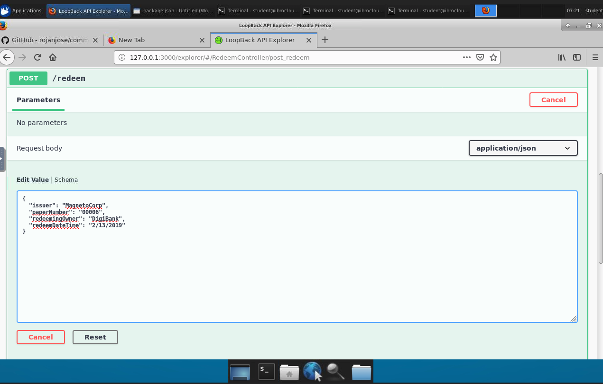

### 3. Build a client application using Loopback 4 and Hyperledger Fabric Node.js SDK 
At this point, we will use a client application generated with Loopback 4 (a tool for building APIs)
to interact with our paper contract. The last transaction we will submit, the `redeem` transaction, will
be submitted using the client app.

#### Step 1 - Install Dependencies.
In VSCode, choose File > Open Folder, and select the `commercialPaperLoopback` folder by navigating to the `home/student/Desktop/commercialPaperLoopback` directory. Highlight the folder by clicking on it, and then click `add`. This is where you will build and run your client app.

Navigate to your `commercialPaperLoopback` folder using terminal. Run git pull and then npm install - 
```
/Desktop/commercialPaperLoopback $ git pull origin master

/Desktop/commercialPaperLoopback $ npm install
```

#### Step 2 - Query State


Let's query the blockchain to get the current state of the ledger. From our `commercialPaperLoopback` directory, 
run `node query.js`

You should see the following output: 


#### Step 3 - Build and Start the App

```
/Desktop/commercialPaperLoopback $ npm start
```

Navigate to http://127.0.0.1:3000/explorer/ in your browser. You should see something like this: 


#### Step 4 - Submit Transactions Using the App
Under `RedeemController` Click on the green POST button next to /redeem on the left-hand side.

You should see our API's parameters here. Click on the `Try it out` on the right-hand side.


Copy and paste the following JSON in the request body:

{
  "issuer": "MagnetoCorp",
  "paperNumber": "00001",
  "redeemingOwner": "DigiBank",
  "redeemDateTime": "2/13/2019"
}

Click on `Execute`.

Your response should look something like this: 


Now, run `node query.js`. You should see that the current state of the 
paper is now in state 3, which means it is now redeemed. 


Congrats! You now know how to use a client app based on TypeScript to 
invoke a contract that was deployed locally using Docker on VSCode! 


[<< Prev (Query worldstate)](Queries.md)