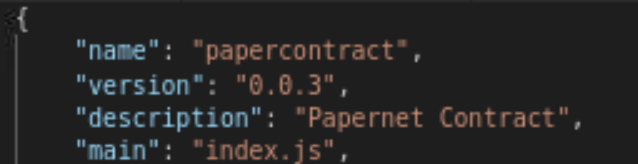
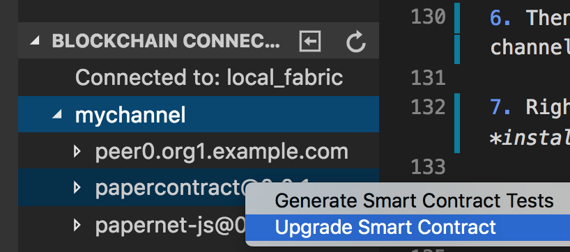
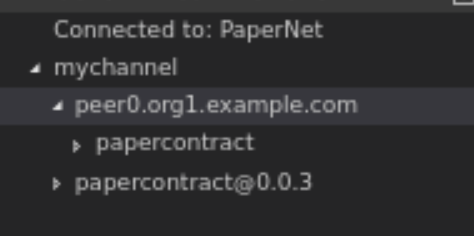
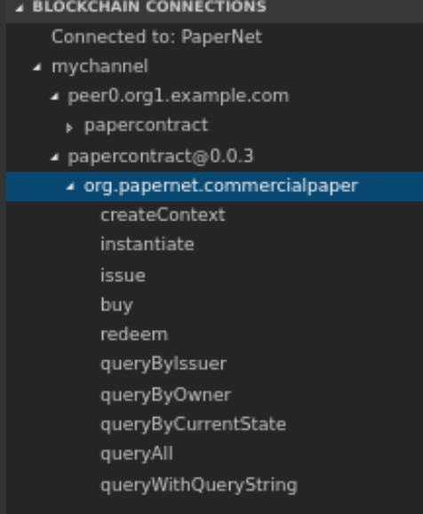

## Querying the World State

In this section we will take a look at how you can query the world state of a channel within Hyperledger Fabric. Before we jump into showing how to query the world state, we first need to understand what database indexes are and how they can help us with queries.

### What are database indexes?

In order to understand indexes, let's take a look at what happens when you query the world state. Say, for example, you want to find all assets owned by the user, "Bob". The database will search through each json document in the database one by one and return all documents that match user = "bob. This might not seem like a big deal but consider if you have millions of documents in your database. These queries might take a while to return the results as the database needs to go through each and every document. With indexes you create a reference that contains all the values of a specific field and which document contains that value. What this means is that instead of searching through every document, the database can just search the index for occurences of the user "bob" and return the documents that are referenced. 

It's important to note that every time a document is added to the database the index needs to be updated. Normally in CouchDB this is done when a query is received but in Hyperledger Fabric the indexes are updated every time a new block is committed which allows for faster querying. This is a process known as **index warming**.

1. Think of different queries that are needed for the application to function
The first step in building an index is understanding what queries are commonly run. Once we understand what queries are important to the application, then we can decide on what fields to include in the index.

In the commercial paper use case we will be querying by issuer, by owner, and by the current state of each asset.

#### Create indexes for those commonly used queries

1. First, create a directory under the **contract** directory of magnetocorp and name the new directory **META-INF**.
2. Then, in the new directory, create another new directory named **statedb**
3. After that, create a new directory inside of **statedb** called **couchdb**
4. Next, you guessed it, create a new directory inside of **couchdb** and name it **indexes**

The directory structure should look like the image below.


1. Now we can start creating our index definitions. Create a new file in the **indexes** directory and name it **issuerIndex.json**
2. Then, copy the following code into that file:

```javascript
{
    "index": {
        "fields": [ "issuer"]
    },
    "ddoc": "issuerIndexDoc",
    "name": "issuerIndex",
    "type": "json"
}
```

This file states that the index will:
- keep track of the *issuer* field of each document
- store this index in a design document (ddoc) named *issuerIndexDoc*
 - is named issuerIndex
- will be in json format

Now let's create two more.

3. Create a new file in the **indexes** directory and name it **ownerIndex.json**
4. Then, copy the following code into that file:

```javascript
{
    "index": {
        "fields": ["owner"]
    },
    "ddoc": "ownerIndexDoc",
    "name": "ownerIndex",
    "type": "json"
}
```

This index is very similar to the previous one for the issuer field but instead we are indexing the *owner* field.

5. Finally, create one last file in the **indexes** directory and name it **currentStateIndex.json**
6. Then, copy the following code into that file:

```javascript
{
    "index": {
        "fields": [ "currentState"]
    },
    "ddoc": "currentStateIndexDoc",
    "name": "currentStateIndex",
    "type": "json"
}
```

Your directory structure should now look like this:


And that's all it takes to build indexes. These indexes will be deployed next time the smart contract is installed and instantiated.

#### Implement query transactions in the smart contract

Now we need to implement the query logic in the transactions of the smart contract. These transactions will be invoked by the Node SDK to execute our queries.

1. If you haven't already, open this repo in your browser within the VM. Do this by going to http://www.github.com/rojanjose/commpaper 

2. In Github, click on the **papercontract.js** file to view it.

3. Then, click on the **Raw** button


4. Once in the raw view, copy everything in this file. It's easy if you use the *control + A* shortcut to copy all.

5. Then, switch back to the VS Code editor and open the **papercontract.js** file. 

6. Delete everything in this file and paste in the version you copied from Github.

This updated contract already has the query logic added. Let's take a look at the transactions that were added.

- queryByIssuer, queryByOwner, and queryByCurrentState - These transactions are all similar in that they take one parameter and query the respective fields in the database. If you look at the *queryString* for each transaction, you will notice that they are pointing to the design documents that hold the indexes that were created earlier. This query string is then passed to *queryWithQueryString* to be executed.

- queryAll - This transaction does what it says. It gets all asset states from the world state database. This query string is then passed to *queryWithQueryString* to be executed.

- queryWithQueryString - This function receives a query string as a parameter and is called by other transactions in the contract to do the actual querying. You can also do ad hoc queries with this transaction by passing in your own query strings.

#### Upgrading the deployed contract
Since we made changes to the smart contract we now need to re-deploy it to the peer.

1. Open up **package.json** in VS Code

2. Change the *version* property to **0.0.2** and save the file.



3. Click on the IBM Blockchain extension icon on the left side of VS Code.

4. Package the contract again by clicking on the plus icon at the top of the *Smart Contract Packages* section on the upper left side.

If necessary, specify to create the package from the *contract* workspace.


5. If you haven't already, click on *local_fabric* under the *Blockchain Connections* section in the lower left in the IBM Blockchain platform extension.

6. Then click on *mychannel* to expand the contents of the channel.

7. Right click on *peer0.org1.example.com* and select *install smart contract*

In the dialog that appears, select the newly packaged papercontract 0.0.2.

8. Then, right click on the existing *papercontract@0.0.1* under *mychanel* and select *upgrade smart contract*.



9. In the dialog, select the newly installed papercontract@0.0.2.

When asked about what function you'd like to call, enter **instantiate**

Then when it asks for arguments to pass, just press enter without typing anything.

10. If successful, you should now see **papercontract@0.0.2** in the bottom left under *mychannel*.



#### Querying the world state
Before we start querying, there's a few quick things we need to do. 

1. Open the terminal in the VM by pressing the *Terminal Emulator* icon at the bottom.


2. Then, run the following command to list all running Docker containers

```
docker ps
```

3. Then, copy the container ID for the very first entry.


4. Next, run the following command while replacing "container ID" with the actual container ID that you copied.

```
docker logs -f "container ID"
```

For example, using the container ID from the screenshot above I would enter this:

```
docker logs -f b989574a090c
```

5. This will allow us to see the outgoing logs from our chaincode container. This will allow you to debug the transactions or, in our case, view the results of the queries.

6. Leave the terminal window open in the background and go back to VS Code.

7. From the IBM Blockchain extension, click on **papercontract@0.0.2** to expand it. 

8. Then click on **org.papernet.commercialpaper** to expand it and show all the transactions contained in the contract.



9. Let's issue another commercial paper. Right click on **issue** and click **submit transaction**

10. For the arguments, enter the following:

```
MagnetoCorp,0002,2019-02-13,2020-02-13,5000000
```
11. Press enter

Now we can begin querying

12. Now right click on **queryAll** from the bottom left of the IBM Blockchain extension and click on **submit transaction**.

13. This transaction doesn't take any arguments so you can just press enter again.

When submitted, check out your terminal window that we left open. It should now show the results of our query.


Since this query simply returns everything in the world state, let's try a different query.

14. Right click on **queryByOwner** and enter the following for the argument:

```
DigiBank
```

Take a look at the logs and see what the output is. Notice that only one document is returned this time. This is because only one asset is owned by DigiBank. This is the asset that we ran the **buy** transaction on earlier which represented DigiBank buying the commercial paper from MagnetoCorp.

15. Next let's right click on **queryByCurrentState** and enter the number **1** as the only argument.

Take a look at the logs again. Only one document is returned again but this time it's for the asset that we just issued. This is becuase the currentState value of **1** indicates those assets that have been issued but not yet bought. 

### Recap of querying
In this section we took a look at how querying works in a Hyperledger Fabric network with CouchDB as the state database. First, we created indexes for commonly used queries. Then, we added the query logic to the smart contract. Finally, we ran some queries and took a look at what the world state contained.


[<< Prev (Setup & run transactions)](README.md)        &nbsp;&nbsp;&nbsp;&nbsp;&nbsp;&nbsp;&nbsp;&nbsp;&nbsp;&nbsp;
[>> Next (Loopback app)](LoopbackApp.md)